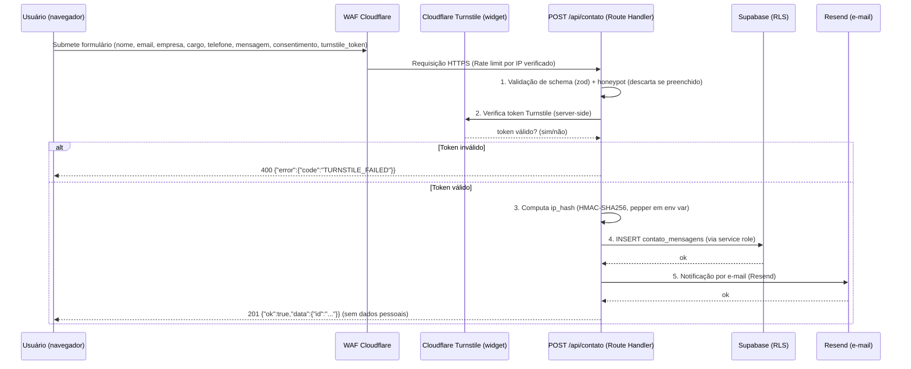

# Arquitetura — Eliora RH

> **Status:** Aprovado (baseline)
> **Versão:** 1.0
> **Data:** 2026-08-12
> **Escopo:** Arquitetura de referência do site institucional Eliora RH e evolução para site completo (blog, newsletter, admin, portal do cliente).

---

## 1. Visão geral

O site da Eliora RH é uma aplicação **server-first** construída com **Next.js (App Router)**, entregue via **CDN global** e com backend em **funções serverless (Route Handlers)**. Os dados são persistidos no **Supabase (PostgreSQL)** com **Row Level Security (RLS)** habilitado em todas as tabelas, garantindo que nenhum dado pessoal seja legível sem política explícita.

A aplicação nasce como landing page estática e evolui de forma incremental:

| Fase | Entrega | Status |
|------|---------|--------|
| 0 | Landing page estática (HTML/CSS/JS atual) | ✅ Produção atual |
| 1 | Site completo: landing + contato + blog + newsletter + LGPD | 🎯 Alvo desta arquitetura |
| 2 | Auth (Supabase Auth) + área administrativa `/admin/*` | Planejada |
| 3 | Portal do cliente `/cliente/*` + integração CRM (webhook) | Planejada |

> **Correspondência de fases:** a **Fase 0** equivale ao `[CORE]` da especificação funcional (landing atual); as **Fases 1–3** da arquitetura correspondem às Fases 1–3 da especificação (`01-funcionalidades/01-especificacao-funcional.md`, §2, catálogo F1–F21). Esta tabela é a contraparte arquitetural daquele catálogo — mantê-las sincronizadas.

Princípios que guiam tudo: **segurança por padrão**, **menor superfície de ataque**, **server-first** e **minimização de dados pessoais (LGPD — Lei nº 13.709/2018**, conforme §1.3 e §1.4 da especificação funcional).

---

## 2. Diagrama de arquitetura

### 2.1 Visão macro (Mermaid)

```mermaid
flowchart LR
    U[Usuário / Cliente] -->|HTTPS| CF[Cloudflare DNS/WAF/CDN]
    CF -->|HTTP/2| CDN[Edge / CDN - Netlify ou Vercel]
    CDN -->|SSR / RSC| NX[Next.js App Router]

    subgraph NX["Camada de Aplicação (Next.js)"]
        NX --> SC[Server Components]
        NX --> RH[Route Handlers - API]
        NX --> MID[Middleware - segurança/rate limit]
    end

    subgraph DATA["Dados"]
        RH -->|supabase-js / service_role| SB[(Supabase PostgreSQL<br/>+ RLS)]
        SC -->|Row-Level queries| SB
        RH -->|Transactional e-mail| RES[Resend / SendGrid]
        RH -->|Webhook| CRM[(CRM / contatos_crm)]
    end

    CF -->|Proteção bots| TS[Cloudflare Turnstile]
    TS --> RH
    NX -->|Erros monitorados| SN[Sentry]
    NX -->|Analytics privacy-first| AN[Plausible / Umami]

    U2[Admin Eliora] -->|fase 2 - auth magic link/OAuth| NX
    U2 --> SB
```

### 2.2 Camadas

| Camada | Tecnologia | Responsabilidade |
|--------|-----------|------------------|
| **Edge / Entrega** | Cloudflare DNS + WAF, CDN (Netlify/Vercel) | TLS, cache estático, mitigação de DDoS, anti-bot |
| **Apresentação** | Next.js Server Components + Tailwind + shadcn/ui | Renderização server-first, SEO, HTML semântico |
| **Aplicação** | Next.js Route Handlers | Validação, anti-spam, orquestração de dados, e-mail |
| **Dados** | Supabase PostgreSQL + RLS | Persistência, autorização em nível de linha, índices |
| **Auth (fase 2)** | Supabase Auth | Login magic link/OAuth, sessão em cookie httpOnly |
| **Observabilidade** | Sentry, Plausible/Umami | Erros, performance, analytics privacy-first |
| **E-mail transacional** | Resend (ou SendGrid) | Notificações de contato, double opt-in de newsletter |

---

## 3. Decisões de arquitetura (ADRs resumidas)

### ADR-001 — Next.js App Router (React Server Components)

**Contexto:** necessidade de site institucional com forte SEO, páginas dinâmicas futuras (blog), e formulários com backend próprio, sem manter servidores dedicados.

**Decisão:** Adotar Next.js 14+ com App Router, TypeScript e Server Components por padrão ("server-first").

**Consequências:**
- Renderização e fetching de dados no servidor → HTML pronto para SEO, menor JS no cliente.
- Route Handlers substituem a necessidade de um backend separado para esta escala.
- Componentes de cliente (`"use client"`) restritos a interações (formulários, menus, etc.).
- Framework com ecossistema maduro (Tailwind, shadcn/ui) e deploy serverless nativo.

### ADR-002 — Supabase (PostgreSQL) com RLS obrigatório

**Contexto:** dados pessoais (LGPD) de interessados em contato e newsletter; necessidade de banco gerenciado, escalável e seguro.

**Decisão:** Usar Supabase (PostgreSQL gerenciado) com **RLS habilitado e obrigatório em todas as tabelas**. O acesso à API é feito pelo lado do servidor (service role / chaves com escopo mínimo), **nunca** expondo a chave pública `anon` a queries de dados pessoais.

**Consequências:**
- Autorização em nível de linha no próprio banco — camada extra além da aplicação.
- Backups, point-in-time recovery e TLS gerenciados pelo provedor.
- Políticas RLS por tabela documentadas em `03-modelo-dados.md`.
- Fase 2: identidade dos admins vem de `auth.users` (Supabase Auth), permitindo políticas baseadas em `auth.uid()`.

### ADR-003 — Server Components como padrão de renderização

**Contexto:** landing institucional com SEO crítico e superfície de ataque que deve permanecer mínima.

**Decisão:** Todo conteúdo público é renderizado no servidor. Dados pessoais e de administração jamais chegam ao bundle do cliente.

**Consequências:**
- Menos JavaScript → melhor Core Web Vitals e custo menor de CDN/edge.
- Secrets de backend (chaves de API, service role) nunca são enviados ao navegador.
- Formulários usam envio a Route Handler com revalidação no servidor.

### ADR-004 — Deploy serverless + CDN (Netlify ou Vercel)

**Contexto:** tráfego institucional brasileiro, custo previsível, zero manutenção de infraestrutura.

**Decisão:** Deploy em plataforma serverless com CDN (Netlify ou Vercel), DNS/WAF na Cloudflare, monitoramento com Sentry.

**Consequências:**
- Escala automática sob demanda; picos de tráfego não exigem provisionamento.
- Prerender estático das rotas públicas + funções serverless sob demanda.
- Cold starts mitigados por keep-alive configurado no provedor e código leve.

### ADR-005 — Anti-spam em múltiplas camadas

**Contexto:** formulário público de contato e newsletter são alvos naturais de spam e abuso de e-mail.

**Decisão:** Honeypot + rate limiting + Cloudflare Turnstile antes de qualquer escrita no banco.

**Consequências:**
- Honeypot: campo oculto que robôs preenchem → descarta silenciosamente.
- Rate limit por IP/email (tabela de contagem ou bucket na edge) → evita brute-force e flood.
- Turnstile: prova de humanidade invisível (sem captcha irritante), validada no servidor.

---

## 4. Fluxo de dados — Formulário de contato

O fluxo abaixo é o caminho crítico da fase 1. Todos os passos acontecem no servidor.



### Passos detalhados

1. **Validação de entrada** — schema estrito (zod) para todos os campos; tamanhos máximos; e-mail normalizado; telefone opcional; consentimento LGPD obrigatório (`true`).
2. **Anti-spam** — honeypot (descarta silencioso, sem mensagem de erro), rate limit (por IP e por e-mail), Turnstile validado no servidor.
3. **Hash do IP** — o IP nunca é armazenado em texto plano; grava-se `ip_hash` (HMAC-SHA256 com pepper via env var), suficiente para auditoria/abuso sem expor dado pessoal.
4. **Persistência** — insert via `service_role` (server-side), tabela protegida por RLS (`USING (false)` — nada lê pela API anônima).
5. **Notificação** — e-mail transacional via Resend com conteúdo mínimo (sem dados sensíveis no assunto).
6. **Resposta** — JSON estruturado `{ ok, data | error }`; **nenhum dado pessoal é ecoado na resposta** além do `id` gerado.

---

## 5. Princípios de arquitetura

### 5.1 Segurança por padrão (default-deny)

- RLS **habilitada em todas as tabelas**; a política padrão é `USING (false)` até que exista política explícita.
- Segredo da API (`service_role`) restrito a ambiente de servidor; chave `anon` **não** recebe grants de leitura/escrita em tabelas com dados pessoais.
- Headers de segurança (CSP, HSTS, X-Content-Type-Options, Referrer-Policy) aplicados na resposta de todas as páginas e APIs.
- Senhas: **nunca** armazenadas em texto plano. Quando aplicável (fase 2/3), gerenciadas pelo Supabase Auth (hash bcrypt/Argon2 nativo) — ver `03-modelo-dados.md` §8.

### 5.2 Menor superfície de ataque

- Apenas as rotas documentadas existem; rotas não listadas não são implementadas.
- Formulários só aceitam payloads com schema estrito; campos desconhecidos são rejeitados ou ignorados.
- Nenhuma API expõe dados pessoais: respostas são DTOs construídos no servidor (ex.: `ip_hash`, nunca IP; e-mail nunca retornado).
- Sem bibliotecas client-side desnecessárias; bundles pequenos e auditados.

### 5.3 Server-first

- Renderização e consultas de dados no servidor; o cliente só envia intenções (submit de formulário, navegação).
- Fetch de dados pessoais somente em código que roda no servidor.
- Componentes interativos mínimos e isolados (`"use client"`).

### 5.4 Dados minimizados (LGPD art. 6º, III)

- Coleta apenas o necessário à finalidade (contato: nome, email, empresa, cargo, telefone opcional, mensagem, consentimento).
- IP armazenado **apenas como hash**; TTL de 90 dias para mensagens (ver §6 e `03-modelo-dados.md` §7).
- Newsletter segue **double opt-in**; e-mail é o único dado coletado.
- Nenhum dado é coletado para "fins futuros indefinidos"; cada tabela tem finalidade e base legal documentadas.

---

## 6. Segurança, retenção e LGPD

| Item | Decisão |
|------|---------|
| **Base legal principal** | Consentimento expresso (LGPD art. 7º, I) para contato/newsletter; legítimo interesse para medidas antifraude/anti-spam (hash, sem dado pessoal direto) |
| **Retenção de mensagens de contato** | 90 dias corridos após criação; exclusão automática via `pg_cron`/função agendada |
| **Newsletter** | 12 meses sem abertura/clique → re-consentimento; exclusão imediata ao opt-out (link em todo e-mail) |
| **Hash de IP** | TTL igual ao registro pai; irreversível (HMAC-SHA256, pepper em env var, jamais em código) |
| **Direitos do titular** | Canal `/privacidade` e contato dedicado; procedimento de exportação/exclusão documentado em `03-modelo-dados.md` §7 |
| **Notificação de violação** | Incidentes comunicados à ANPD e aos titulares conforme art. 48 da LGPD; trilha de auditoria em `docs/06-auditoria` |

---

## 7. Escalabilidade e custo

### Escalabilidade

- **Horizontal automática:** funções serverless (Next.js) e Postgres gerenciado (Supabase) escalam sem provisionamento manual.
- **Cache na edge:** rotas públicas são estáticas/prerenderizadas e servidas pelo CDN — o banco é tocado apenas quando há dado dinâmico (blog, formulários).
- **Índices:** todas as colunas de busca/filtro têm índices (slug, email, status, created_at) — ver `03-modelo-dados.md`.
- **Gargalo previsto:** envio de e-mail transacional e verificação Turnstile são I/O externo; mitigado com fila/retry simples e timeouts curtos no Route Handler.
- **Hot path de escrita:** formulários geram poucas escritas; para picos (campanha de marketing), usar rate limit por IP e fila de e-mail.

### Custo estimado (fase 1)

| Recurso | Modelo | Custo típico |
|---------|--------|--------------|
| Hosting/CDN (Netlify ou Vercel) | Free/Pro por site | R$ 0–50/mês |
| Supabase | Free (500 MB, 50k MAU) | R$ 0 (início) |
| Resend | Free (3.000 e-mails/mês) | R$ 0 (início) |
| Cloudflare (DNS/WAF/Turnstile) | Free | R$ 0 |
| Sentry | Free (erros) / Pro opcional | R$ 0– |
| Analytics (Plausible/Umami) | Self-host ou plano pequeno | R$ 0–29/mês |

**Crescimento:** monitorar consumo do Supabase (storage/banda) e limite de e-mails do Resend. Quando o volume justificar, migrar para planos pagos sem mudança de arquitetura.

---

## 8. Referências

- Rotas e APIs: [`02-rotas.md`](./02-rotas.md)
- Modelo de dados, RLS e LGPD: [`03-modelo-dados.md`](./03-modelo-dados.md)
- Funcionalidades: `../01-funcionalidades/`
- Segurança (hardening, incidentes): `../03-seguranca/`
- Roadmap (fases 2 e 3): `../05-roadmap/`
