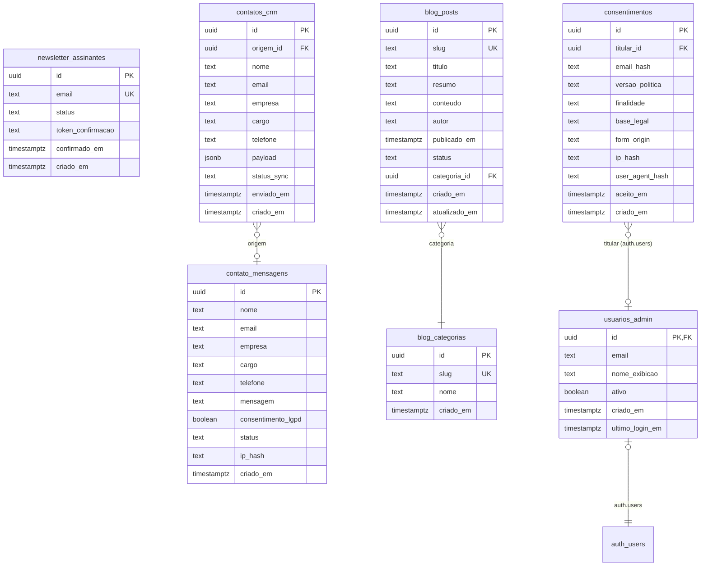

# Modelo de Dados — Eliora RH (Supabase/PostgreSQL)

> **Status:** Aprovado (baseline — resposta ao red team aplicada)
> **Versão:** 1.1
> **Data:** 2026-08-12
> **Escopo:** Schema do banco (Supabase), políticas RLS, mapeamento LGPD, retenção e exclusão de dados.

---

## 0. Princípios globais do banco

- **RLS habilitada em TODAS as tabelas** (`ALTER TABLE ... ENABLE ROW LEVEL SECURITY`). Política padrão `USING (false)` — sem política, nada é legível/gravável.
- **Acesso por API:** o site acessa via `service_role` (server-side, Route Handlers), que **não depende de RLS**, mas a superfície pública (`anon`/`authenticated`) **nunca** recebe grants em tabelas com dados pessoais.
- **Senhas:** nunca em texto plano — gerenciadas exclusivamente pelo Supabase Auth (hash Argon2/bcrypt no próprio provedor). Não existe coluna de senha em nenhuma tabela do schema.
- **Dados sensíveis:** IP armazenado somente como `ip_hash` (HMAC-SHA256, pepper em variável de ambiente, jamais em código); e-mail armazenado apenas quando necessário à finalidade.
- **Time zone:** todos os timestamps em `timestamptz` (UTC).
- **Convenção de nomes:** snake_case, plural para tabelas, `id` UUID `gen_random_uuid()` (pgcrypto).

### 0.1 Grants e RLS padrão — default-deny explícito (RT-001)

Toda tabela começa **sem nenhum grant** para `anon`/`authenticated`. A superfície pública REST/Auth do Supabase (PostgREST, alcançável com a `anon key` exposta no bundle) **só enxerga o que for explicitamente concedido**. Executar no projeto Supabase:

```sql
-- Default-deny global (schema public): nenhuma tabela/sequência/função
-- fica acessível a anon/authenticated por padrão.
REVOKE ALL ON SCHEMA public FROM anon, authenticated;
REVOKE ALL ON ALL TABLES IN SCHEMA public FROM anon, authenticated;
REVOKE ALL ON ALL SEQUENCES IN SCHEMA public FROM anon, authenticated;
REVOKE ALL ON ALL FUNCTIONS IN SCHEMA public FROM anon, authenticated;

-- Grants mínimos — SOMENTE o necessário, tabela a tabela:
GRANT SELECT ON public.blog_posts TO anon;            -- leitura pública (status='publicado', via RLS)
GRANT SELECT ON public.blog_categorias TO anon;       -- apenas nome/slug (via RLS FOR SELECT)
GRANT SELECT, UPDATE ON public.usuarios_admin TO authenticated;  -- própria linha, via RLS FOR SELECT/FOR UPDATE

-- As demais tabelas (contato_mensagens, newsletter_assinantes, consentimentos,
-- contatos_crm) NÃO recebem grant público: escrita/leitura apenas via
-- service_role (server-side) ou funções SECURITY DEFINER específicas.
```

> **Regra de ouro (RT-001):** se uma chamada `GET/POST https://<ref>.supabase.co/rest/v1/<tabela>` com a `anon key` do bundle não for **necessária** para a funcionalidade pública, ela deve retornar **401/403**. A força dessa configuração é verificada em ST-086 e HC-093, nunca assumida.
>
> **Médio prazo (RT-001/RT-002):** substituir o `service_role` onipresente por um **role Postgres próprio da aplicação** com grants mínimos por tabela, reduzindo o impacto de vazamento de uma única chave global.

---

## 1. Tabela `contato_mensagens`

Mensagens enviadas pelo formulário de contato. Finalidade: **atendimento comercial** à solicitação do interessado.

| Coluna | Tipo | Constraints | Descrição |
|--------|------|-------------|-----------|
| `id` | `uuid` | PK, default `gen_random_uuid()` | Identificador |
| `nome` | `text` | NOT NULL, CHECK (`length(nome) BETWEEN 2 AND 120`) | Nome do interessado |
| `email` | `text` | NOT NULL, CHECK (validação básica + lowercase) | E-mail para retorno |
| `empresa` | `text` | NOT NULL, CHECK (2..120) | Empresa |
| `cargo` | `text` | NULL, CHECK (0..120) | Cargo (opcional) |
| `telefone` | `text` | NULL, CHECK (0..20) | Telefone (opcional; formato BR) |
| `mensagem` | `text` | NOT NULL, CHECK (10..2000) | Conteúdo da mensagem |
| `consentimento_lgpd` | `boolean` | NOT NULL, DEFAULT `false` | Consentimento expresso (art. 7º, I) |
| `status` | `text` | NOT NULL, DEFAULT `'novo'`, CHECK (`status IN ('novo','em_andamento','respondido','arquivado','excluido')`) | Ciclo de atendimento |
| `ip_hash` | `text` | NULL | Hash HMAC-SHA256 do IP (nunca o IP) — anti-abuso |
| `criado_em` | `timestamptz` | NOT NULL, DEFAULT `now()` | Data de envio |

**Índices:**

- `idx_contato_created_at` on `(criado_em)` — TTL/retenção e ordenação do admin.
- `idx_contato_status` on `(status)` — filtro de triagem.
- `idx_contato_email` on `(email)` — busca por titular (direitos LGPD).

**RLS:**

```sql
ALTER TABLE public.contato_mensagens ENABLE ROW LEVEL SECURITY;

-- Padrão default-deny explícito: nada é lido/escrito pela API pública.
REVOKE ALL ON public.contato_mensagens FROM anon, authenticated;
-- Nenhuma policy é criada para anon/authenticated:
-- sem policy + sem grant = 401/403 no PostgREST (RT-001).

-- Guarda de integridade (RT-003): `status` e `criado_em` são SEMPRE do
-- servidor — um client que tente mass assignment (inserir status/criado_em
-- futuros para derrotar o TTL de retenção LGPD) é neutralizado no banco.
CREATE OR REPLACE FUNCTION public.normalizar_contato_mensagens()
RETURNS trigger AS $$
BEGIN
  NEW.criado_em := now();   -- ignora data futura injetada
  NEW.status   := 'novo';   -- ignora status injetado (ex.: 'em_andamento')
  RETURN NEW;
END;
$$ LANGUAGE plpgsql SECURITY DEFINER;

CREATE TRIGGER trg_normalizar_contato_mensagens
  BEFORE INSERT ON public.contato_mensagens
  FOR EACH ROW EXECUTE FUNCTION public.normalizar_contato_mensagens();
```

> **Nota:** a escrita é feita exclusivamente pelo servidor (`service_role`). Na fase 2, `usuarios_admin` autenticados poderão ler via RLS com política `USING (auth.uid() IN (SELECT ... FROM usuarios_admin WHERE ativo))`.

---

## 2. Tabela `newsletter_assinantes`

Assinantes da newsletter com **double opt-in**. Finalidade: **envio de conteúdo informativo** com consentimento.

| Coluna | Tipo | Constraints | Descrição |
|--------|------|-------------|-----------|
| `id` | `uuid` | PK, default `gen_random_uuid()` | Identificador |
| `email` | `text` | NOT NULL, UNIQUE (lowercase/trim) | E-mail do assinante |
| `status` | `text` | NOT NULL, DEFAULT `'pendente'`, CHECK (`status IN ('pendente','confirmado','cancelado')`) | Ciclo do opt-in |
| `token_confirmacao` | `text` | NULL | **Hash** do token aleatório de confirmação (não o token bruto) |
| `confirmado_em` | `timestamptz` | NULL | Quando confirmou |
| `criado_em` | `timestamptz` | NOT NULL, DEFAULT `now()` | Data de inscrição |

**Índices:**

- `idx_newsletter_email` on `(email)` — suporte ao UNIQUE e direitos do titular.
- `idx_newsletter_status` on `(status)` — campanhas e limpeza de pendentes (>7 dias).
- `idx_newsletter_token` on `(token_confirmacao)` — lookup da confirmação.

**RLS:**

```sql
ALTER TABLE public.newsletter_assinantes ENABLE ROW LEVEL SECURITY;

-- Default-deny explícito: sem grants públicos (RT-001).
REVOKE ALL ON public.newsletter_assinantes FROM anon, authenticated;
-- Nenhuma policy para anon/authenticated. O token de confirmação é armazenado
-- hasheado; o valor bruto trafega apenas no e-mail (e nunca em query string,
-- ver RT-009/RT-012).
```

> Mesma regra de `contato_mensagens`: escrita somente via servidor; sem grants públicos. O token é armazenado **hasheado**; o valor bruto é enviado apenas no e-mail e validado em memória no handler.

---

## 3. Tabela `blog_posts`

Artigos do blog. Finalidade: **comunicação institucional** (conteúdo público).

| Coluna | Tipo | Constraints | Descrição |
|--------|------|-------------|-----------|
| `id` | `uuid` | PK, default `gen_random_uuid()` | Identificador |
| `slug` | `text` | NOT NULL, UNIQUE | Slug canônico (kebab-case) |
| `titulo` | `text` | NOT NULL, CHECK (3..200) | Título |
| `resumo` | `text` | NOT NULL, CHECK (10..300) | Resumo/description |
| `conteudo` | `text` | NOT NULL | Corpo (Markdown) |
| `autor` | `text` | NOT NULL | Nome do autor |
| `publicado_em` | `timestamptz` | NULL (NULL = rascunho) | Data de publicação |
| `status` | `text` | NOT NULL, DEFAULT `'rascunho'`, CHECK (`status IN ('rascunho','revisao','publicado','arquivado')`) | Estado editorial |
| `categoria_id` | `uuid` | NULL, FK → `blog_categorias.id` ON DELETE SET NULL | Categoria |
| `criado_em` | `timestamptz` | NOT NULL, DEFAULT `now()` | Criação |
| `atualizado_em` | `timestamptz` | NOT NULL, DEFAULT `now()` | Última edição |

**Índices:**

- `idx_blog_slug` on `(slug)` — busca por URL.
- `idx_blog_status_publicado` on `(status, publicado_em DESC)` — listagem pública.
- `idx_blog_categoria` on `(categoria_id)` — filtro por categoria.

**RLS:**

```sql
ALTER TABLE public.blog_posts ENABLE ROW LEVEL SECURITY;

-- Política pública de leitura (somente publicados):
CREATE POLICY "blog_publico_select"
  ON public.blog_posts FOR SELECT
  USING (status = 'publicado');

-- Escrita/edição: apenas admin autenticado (fase 2):
-- CREATE POLICY "blog_admin_write" ... USING/CHECK (auth.uid() IN (admin));
```

> A leitura pública funciona com a chave `anon` via RLS — mas **somente para `blog_posts` publicados** e **sem colunas pessoais** (a tabela não contém dados pessoais). `conteudo` completo não é retornado em listagens (query do handler seleciona apenas `titulo`, `resumo`, `slug`, `publicado_em`).

---

## 4. Tabela `blog_categorias`

Categorias do blog. Finalidade: **organização editorial**.

| Coluna | Tipo | Constraints | Descrição |
|--------|------|-------------|-----------|
| `id` | `uuid` | PK, default `gen_random_uuid()` | Identificador |
| `slug` | `text` | NOT NULL, UNIQUE | Slug (kebab-case) |
| `nome` | `text` | NOT NULL, CHECK (2..80) | Nome exibido |
| `criado_em` | `timestamptz` | NOT NULL, DEFAULT `now()` | Criação |

**RLS:**

```sql
ALTER TABLE public.blog_categorias ENABLE ROW LEVEL SECURITY;

-- Política pública de leitura EXPLÍCITA com FOR SELECT (nunca FOR ALL):
CREATE POLICY "blog_categorias_select"
  ON public.blog_categorias FOR SELECT
  USING (true);   -- somente nome/slug (a tabela não tem dados pessoais)

-- Grants mínimos: leitura pública; NADA de escrita para anon/authenticated.
REVOKE ALL ON public.blog_categorias FROM anon, authenticated;
GRANT SELECT ON public.blog_categorias TO anon;

-- Escrita apenas por admin autenticado (fase 2) via policy separada.
```

---

## 5. Tabela `usuarios_admin` (espelha `auth.users`)

Não é uma tabela de credenciais — senhas vivem exclusivamente no `auth.users` do Supabase Auth. Esta tabela mapeia usuários autenticados para o papel de admin do site.

| Coluna | Tipo | Constraints | Descrição |
|--------|------|-------------|-----------|
| `id` | `uuid` | PK, FK → `auth.users(id)` ON DELETE CASCADE | Mesmo `uid` da autenticação |
| `email` | `text` | NOT NULL (espelho de `auth.users.email`) | Identificação |
| `nome_exibicao` | `text` | NOT NULL, CHECK (2..120) | Nome no admin |
| `ativo` | `boolean` | NOT NULL, DEFAULT `true` | Habilita/desabilita acesso |
| `criado_em` | `timestamptz` | NOT NULL, DEFAULT `now()` | Criação |
| `ultimo_login_em` | `timestamptz` | NULL | Auditoria |

**RLS:**

```sql
ALTER TABLE public.usuarios_admin ENABLE ROW LEVEL SECURITY;

-- Default-deny de escrita: NENHUMA política de INSERT/DELETE.
REVOKE ALL ON public.usuarios_admin FROM anon, authenticated;
GRANT SELECT, UPDATE ON public.usuarios_admin TO authenticated;  -- próprio registro apenas

-- O usuário lê apenas a própria linha (FOR SELECT EXPLÍCITO — RT-002):
CREATE POLICY "admin_self_select"
  ON public.usuarios_admin FOR SELECT
  USING (id = auth.uid());

-- O usuário atualiza a própria linha, mas NUNCA consegue alterar `ativo`
-- (WITH CHECK restrito a UPDATE, sem auto-promoção/auto-rebaixamento):
CREATE POLICY "admin_self_update"
  ON public.usuarios_admin FOR UPDATE
  USING (id = auth.uid())
  WITH CHECK (id = auth.uid() AND ativo IS NOT DISTINCT FROM true);

-- NOTE: NÃO existe política FOR INSERT. Um usuário autenticado (signup do
-- Supabase) que tente INSERT da própria linha em usuarios_admin recebe 403 —
-- RLS nega por ausência de política + grant INSERT revogado.

-- Guarda de escalonamento (defense in depth, RT-002): bloqueia no banco
-- qualquer INSERT e qualquer alteração de `ativo` vinda de sessão autenticada.
-- A promoção de admin acontece APENAS via função administrativa dedicada
-- public.promover_admin() (SECURITY DEFINER, executada com service_role).
CREATE OR REPLACE FUNCTION public.guardar_usuarios_admin()
RETURNS trigger AS $$
BEGIN
  IF auth.uid() IS NOT NULL THEN
    IF TG_OP = 'INSERT' THEN
      RAISE EXCEPTION 'usuarios_admin: criação de admin via aplicação é bloqueada';
    END IF;
    IF NEW.ativo IS DISTINCT FROM OLD.ativo THEN
      RAISE EXCEPTION 'usuarios_admin: alteração de ativo via aplicação é bloqueada; use public.promover_admin()';
    END IF;
  END IF;
  RETURN NEW;
END;
$$ LANGUAGE plpgsql SECURITY DEFINER;

CREATE TRIGGER trg_guardar_usuarios_admin
  BEFORE INSERT OR UPDATE ON public.usuarios_admin
  FOR EACH ROW EXECUTE FUNCTION public.guardar_usuarios_admin();
```

> **Regra de segurança (RT-002):** a promoção a admin exige **ação administrativa explícita** via função dedicada `public.promover_admin(uid, email, nome)` (SECURITY DEFINER, executada com `service_role`) ou SQL administrativo — **nunca** por autoatendimento e **nunca** por política RLS `FOR ALL`.

---

## 6. Tabela `contatos_crm` (integração por webhook)

Espelho dos contatos encaminhados ao CRM. Finalidade: **integração com sistema externo** (CRM do contratante/consultoria).

| Coluna | Tipo | Constraints | Descrição |
|--------|------|-------------|-----------|
| `id` | `uuid` | PK, default `gen_random_uuid()` | Identificador |
| `origem_id` | `uuid` | NULL, FK → `contato_mensagens.id` ON DELETE SET NULL | Mensagem de origem |
| `nome` | `text` | NOT NULL | Nome |
| `email` | `text` | NOT NULL | E-mail |
| `empresa` | `text` | NULL | Empresa |
| `cargo` | `text` | NULL | Cargo |
| `telefone` | `text` | NULL | Telefone |
| `payload` | `jsonb` | NOT NULL DEFAULT `'{}'` | Payload enviado ao CRM (log) |
| `status_sync` | `text` | NOT NULL DEFAULT `'pendente'`, CHECK (`status_sync IN ('pendente','enviado','erro')`) | Estado do webhook |
| `enviado_em` | `timestamptz` | NULL | Confirmação do CRM |
| `criado_em` | `timestamptz` | NOT NULL, DEFAULT `now()` | Criação |

**RLS:**

```sql
ALTER TABLE public.contatos_crm ENABLE ROW LEVEL SECURITY;
REVOKE ALL ON public.contatos_crm FROM anon, authenticated;
```

Acesso exclusivo via servidor/service_role (nunca público). **Nunca** exposta em resposta de API. O `payload` (jsonb) é gravado com schema validado (zod) antes do insert e **nunca** aceita URL/configuração derivada de input (RT-007).

---

## 7. Tabela `consentimentos` (registro de consentimento LGPD)

Registro **append-only** de cada consentimento coletado (formulário de contato, newsletter, cookies). Finalidade: **comprovar a base legal do art. 7º, I / 8º da LGPD** e responder a auditorias da ANPD — quem consentiu, quando, para qual finalidade e com qual versão da política. Esta tabela torna executáveis os casos ST-077/ST-078 e o item HC-077.

| Coluna | Tipo | Constraints | Descrição |
|--------|------|-------------|-----------|
| `id` | `uuid` | PK, default `gen_random_uuid()` | Identificador |
| `titular_id` | `uuid` | NULL, FK → `auth.users(id)` ON DELETE SET NULL | Titular autenticado (fase 2+); `NULL` para visitantes anônimos |
| `email_hash` | `text` | NULL, CHECK (64 hex) | HMAC-SHA256 do e-mail do titular — correlaciona consentimentos do mesmo titular **sem PII em claro** |
| `versao_politica` | `text` | NOT NULL, CHECK (`versao_politica ~ '^v[0-9]+\.[0-9]+$'`) | Versão da política de privacidade aceita |
| `finalidade` | `text` | NOT NULL, CHECK (`finalidade IN ('contato','newsletter','cookies')`) | Finalidade do tratamento |
| `base_legal` | `text` | NOT NULL, CHECK (`base_legal IN ('art7_I','art7_IX')`) | Base legal registrada |
| `form_origin` | `text` | NOT NULL, CHECK (`form_origin IN ('form_contato','form_newsletter','banner_cookies','admin')`) | Origem do consentimento |
| `ip_hash` | `text` | NULL | Hash HMAC-SHA256 do IP (nunca o IP bruto) |
| `user_agent_hash` | `text` | NULL | Hash HMAC-SHA256 do User-Agent (pseudonimização) |
| `aceito_em` | `timestamptz` | NOT NULL, DEFAULT `now()` | Momento do consentimento |
| `criado_em` | `timestamptz` | NOT NULL, DEFAULT `now()` | Criação do registro |

**Índices:**

- `idx_consentimentos_titular` on `(email_hash)` — correlação por titular (direitos LGPD).
- `idx_consentimentos_aceito_em` on `(aceito_em)` — TTL (5 anos) e auditoria.

**RLS (append-only — nenhuma escrita/leitura pública):**

```sql
ALTER TABLE public.consentimentos ENABLE ROW LEVEL SECURITY;

-- Nenhuma policy e nenhum grant para anon/authenticated:
REVOKE ALL ON public.consentimentos FROM anon, authenticated;
GRANT SELECT, INSERT ON public.consentimentos TO service_role;

-- Append-only: UPDATE sempre bloqueado; DELETE permitido somente pelo job de
-- TTL autorizado (sessão com app.ttl_job='true', ver §9.1 Retenção).
CREATE OR REPLACE FUNCTION public.guardar_consentimento()
RETURNS trigger AS $$
BEGIN
  IF TG_OP = 'UPDATE' THEN
    RAISE EXCEPTION 'consentimentos: registro append-only — alteração bloqueada';
  END IF;
  IF TG_OP = 'DELETE' AND current_setting('app.ttl_job', true) IS DISTINCT FROM 'true' THEN
    RAISE EXCEPTION 'consentimentos: exclusão apenas via job de TTL autorizado';
  END IF;
  RETURN NEW;
END;
$$ LANGUAGE plpgsql SECURITY DEFINER;

CREATE TRIGGER trg_guardar_consentimento
  BEFORE UPDATE OR DELETE ON public.consentimentos
  FOR EACH ROW EXECUTE FUNCTION public.guardar_consentimento();
```

> **Escrita:** feita pelo servidor (Route Handler) junto de cada submissão de formulário/newsletter/banner de cookies, registrando `versao_politica`, `finalidade`, `base_legal`, `form_origin`, `ip_hash` e `user_agent_hash`. O consentimento é **pré-requisito** para persistir `contato_mensagens`/`newsletter_assinantes` (ST-077/HC-076/HC-104).

---

## 8. Mapeamento de dados pessoais (LGPD)

| Tabela | Dados pessoais | Finalidade | Base legal (art. 7º) | Retenção (TTL) | Minimização |
|--------|----------------|------------|----------------------|----------------|-------------|
| `contato_mensagens` | nome, email, empresa, cargo, telefone, mensagem, `ip_hash` | Atendimento à solicitação de contato comercial | I — Consentimento | **90 dias** após `criado_em`; exclusão automática | Apenas campos do formulário; telefone/cargo opcionais; IP só como hash |
| `newsletter_assinantes` | email | Envio de newsletter (conteúdo institucional) | I — Consentimento (double opt-in) | Indeterminada enquanto consentir; **re-consentimento a cada 12 meses**; exclusão imediata no opt-out | Somente e-mail + timestamps/token (hash) |
| `blog_posts` / `blog_categorias` | nome do autor | Autoria editorial | — (não é dado pessoal sensível; dado público autorizado) | Indeterminada (conteúdo editorial) | Nome apenas; sem contato |
| `usuarios_admin` | email, nome_exibicao | Gestão administrativa | Legítimo interesse + vínculo contratual/emprego | Enquanto ativo; removido ao desligar (`ativo=false` + exclusão após período legal) | Mínimo necessário ao acesso |
| `contatos_crm` | nome, email, empresa, cargo, telefone | Integração CRM (encaminhamento autorizado) | I — Consentimento (originado em `contato_mensagens`) | Espelha TTL de `contato_mensagens` (90 dias) | Payload mínimo, sem `ip_hash` |
| `consentimentos` | `email_hash`, `ip_hash`, `user_agent_hash` (todos pseudonimizados) | Registro de consentimento (prova da base legal — art. 7º, I e 8º) | I — Consentimento | **5 anos** (prazo de prescrição legal); exclusão automática após | Sem PII em claro (somente hashes) |

### 8.1 Direitos do titular (arts. 18–19)

- **Acesso/Portabilidade:** endpoint/função administrativa que exporta registros por e-mail (busca via `idx_contato_email`, `idx_newsletter_email`).
- **Correção:** atualização de dados via admin, com trilha de auditoria.
- **Exclusão (direito ao esquecimento):** exclusão física em todas as tabelas relacionadas ao e-mail (contato, newsletter, CRM) em ≤ 15 dias.
- **Cancelamento de newsletter:** link de opt-out presente em **todo** e-mail enviado; processamento imediato (`status = 'cancelado'` → exclusão).

---

## 9. Retenção e exclusão de dados

### 9.1 Exclusão automática (job agendado)

Via `pg_cron` (extensão habilitada no Supabase) ou função agendada externamente:

```sql
-- Exemplo (contato_mensagens — TTL 90 dias):
SELECT cron.schedule(
  'limpa-contato',
  '0 3 * * *',
  $$ DELETE FROM public.contato_mensagens
      WHERE criado_em < now() - interval '90 days'
        AND status <> 'em_andamento'; $$  -- mensagens em andamento requerem revisão manual
);
```

| Rotina | Regra | Frequência |
|--------|-------|------------|
| Exclusão `contato_mensagens` | `criado_em < now() - 90 dias` e status fora de `em_andamento` | Diária (03:00 UTC) |
| Exclusão `contatos_crm` | Espelha a origem (90 dias) | Diária |
| Limpeza `newsletter_assinantes` pendentes | `criado_em < now() - 7 dias` e `status = 'pendente'` | Diária |
| Re-consentimento newsletter | `confirmado_em < now() - 12 meses` → e-mail de re-consentimento; sem resposta → `cancelado` + exclusão | Mensal |
| Exclusão `consentimentos` (TTL) | `aceito_em < now() - 5 anos` (prazo de prescrição); job roda com `SET app.ttl_job = 'true'` para passar pela guarda append-only | Anual |

### 9.2 Exclusão manual (direito do titular)

1. Solicitação por e-mail/canal oficial (identificado em `/privacidade`).
2. Verificação de identidade (e-mail de confirmação) — evita exclusão de terceiros.
3. Exclusão física nas tabelas: `contato_mensagens`, `newsletter_assinantes`, `contatos_crm` (quando aplicável).
4. Confirmação ao titular em ≤ 15 dias (prazo LGPD).

### 9.3 Práticas gerais

- `DELETE` físico (não apenas `soft delete`), salvo quando a lei exigir retenção (fiscal/trabalhista).
- `contato_mensagens.status = 'excluido'` existe apenas como marcação de triagem pré-exclusão física.
- Backups do Supabase seguem política de retenção do provedor; dados pessoais excluídos são respeitados via exclusão física anterior ao ciclo de backup.

---

## 10. Diagrama do schema (Mermaid)



---

## 11. Checklist de segurança do schema

- [ ] RLS habilitada em **todas** as 7 tabelas (verificação via `SELECT relname FROM pg_class WHERE relrowsecurity = 't'`).
- [ ] **Grants default-deny:** `anon`/`authenticated` sem grants em tabelas com PII — verificação via `information_schema.role_table_grants` (HC-093).
- [ ] Nenhuma policy `FOR ALL` em tabelas sensíveis; `usuarios_admin` com `FOR SELECT`/`FOR UPDATE` apenas, sem INSERT (HC-094).
- [ ] Nenhuma coluna de senha em qualquer tabela; auth delegado ao Supabase Auth.
- [ ] `ip_hash` irreversível (HMAC-SHA256 + pepper em env var) e sem coluna de IP bruto.
- [ ] Token de confirmação de newsletter armazenado **hasheado**, nunca em texto plano e nunca em query string.
- [ ] Tabela `consentimentos` criada, **append-only** e preenchida a cada consentimento (ST-077/078, HC-104).
- [ ] Trigger anti-mass-assignment em `contato_mensagens` (normaliza `status`/`criado_em`) e guarda de escalonamento em `usuarios_admin`.
- [ ] Respostas de API são DTOs — sem e-mail/telefone/IP em nenhum payload de retorno.
- [ ] Chaves `service_role` restritas a variáveis de ambiente do deploy (nunca no bundle client).
- [ ] Grants `anon` limitados: apenas `SELECT` em `blog_posts` (publicado) e `blog_categorias` (nome/slug).
