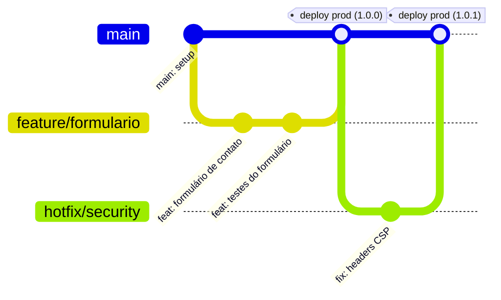
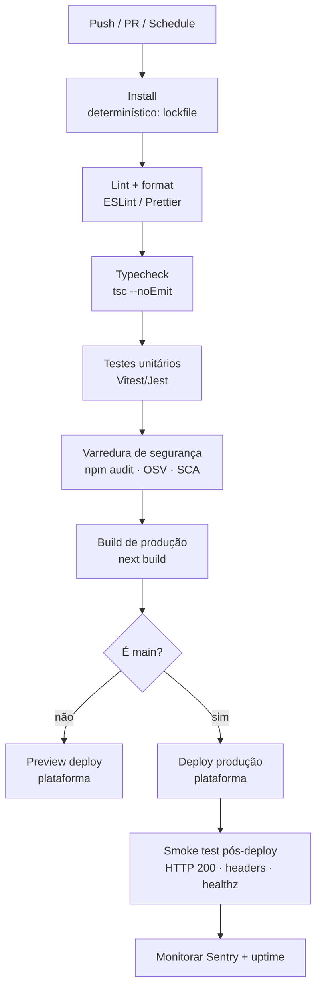
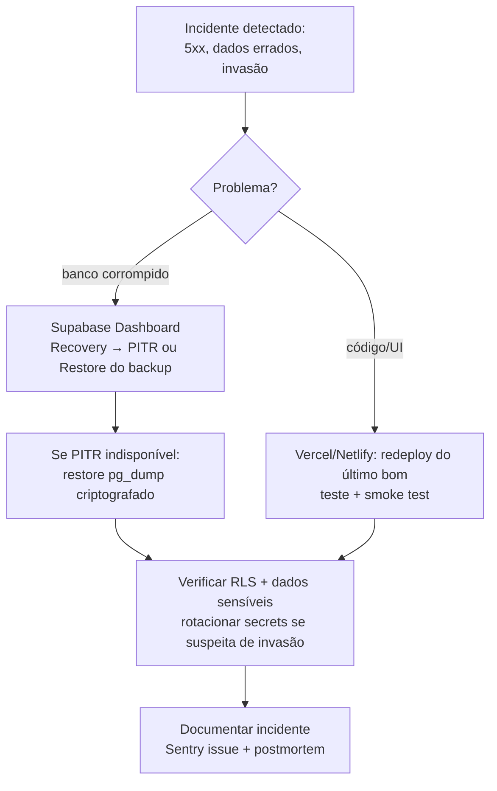

# Infraestrutura — Eliora RH

> **Status:** proposta técnica para implementação
> **Público:** devs, DevOps, administradores do sistema
> **Documentos relacionados:** [03-seguranca](../03-seguranca) · [04-testes](../04-testes)
> **Última revisão:** 2026-08-12

Este documento descreve a arquitetura de infraestrutura, o pipeline de CI/CD, a configuração de domínio/DNS, secrets, segurança de rede, monitoramento, backup/DR, performance e custos do site institucional **Eliora RH**.

---

## 1. Visão geral da infraestrutura

O site é uma aplicação **Next.js (App Router)** com renderização estática/SSG para páginas institucionais e **Route Handlers serverless** para formulários e ações dinâmicas. O banco de dados é o **Supabase (PostgreSQL)** com RLS (Row Level Security). E-mail transacional via **Resend**. Tudo fica atrás do **Cloudflare** (DNS, WAF, CDN e proteção DDoS).

```mermaid
flowchart LR
    U[Usuário / Navegador] -->|HTTPS| CF[Cloudflare\nDNS + WAF + CDN + DDoS/Bot\nHSTS · TLS 1.2+]
    CF -->|rota cacheada / estática| V[Vercel ou Netlify\nEstático + Serverless\n(Next.js Route Handlers)]
    CF -->|captcha| T[Turnstile\nproteção de formulários]

    V -->|queries com RLS (anon/service)| DB[(Supabase\nPostgreSQL + RLS)]
    V -->|e-mail transacional| R[Resend]
    V -->|erros + traces| S[Sentry]
    V -->|eventos de analytics| P[Plausible / Umami]

    DB -->|triggers / webhooks| R

    OPS[GitHub\nCI/CD + GitHub Actions] -->|deploy| V
    OPS -->|secrets via plataforma| V

    style CF fill:#f4801f,color:#fff
    style V fill:#000,color:#fff
    style DB fill:#3ecf8e,color:#fff
```

### Fluxo de uma requisição

```
Usuário ──HTTPS──▶ Cloudflare (edge)
                     ├─ WAF/rate-limit/bot management (aplica regras antes de chegar na origem)
                     ├─ Cache de páginas estáticas, imagens e assets (CDN)
                     └────▶ Plataforma (Vercel/Netlify)
                              ├─ Página estática (SSG/ISR) ── HTML já pronto ──▶ navegador
                              └─ Route Handler (serverless)
                                   ├─ valida Turnstile ──▶ Cloudflare Turnstile
                                   ├─ consulta Supabase (RLS aplicada) ──▶ PostgreSQL
                                   └─ dispara e-mail ──▶ Resend
```

**Decisões principais**

| Camada | Escolha | Por quê |
|---|---|---|
| Frontend/Backend | Next.js (App Router) + TS | Um único deploy; Route Handlers no mesmo lugar do front |
| Hosting | **Vercel** (preferência) ou **Netlify** | Gratuito para início, serverless + CDN integrados |
| Banco | Supabase (PostgreSQL + RLS) | Gratuito para início, PITR, RLS nativo para LGPD |
| DNS/WAF/CDN | Cloudflare (Free) | DNS + proxy + WAF + DDoS + bot management |
| E-mail | Resend | API simples, domain verification (SPF/DKIM) |
| Observabilidade | Sentry | Error tracking + traces |
| Analytics | Plausible ou Umami | Privacy-first, sem cookies (LGPD friendly) |
| CI/CD | GitHub Actions + deploy nativo da plataforma | Sem custo, reutiliza secrets da plataforma |

---

## 2. Ambientes

| Ambiente | URL | Branch | Finalidade |
|---|---|---|---|
| Produção | `https://www.eliora-rh.com.br` | `main` | Público, dados reais |
| Preview (PR) | `https://<pr>-eliora.vercel.app` (exemplo) | cada Pull Request | Teste de funcionalidade antes de merge; banco de dados sandbox |
| Local | `http://localhost:3000` | qualquer | Desenvolvimento |

### Estratégia de branches e deploys



- **`main` → produção:** qualquer merge em `main` dispara deploy automático em produção.
- **Pull Requests → preview deploy:** cada PR gera um ambiente efêmero isolado (URL própria) com variáveis de ambiente de *staging* (nunca secrets de produção).
- **Tags (`v*`):** opcionalmente utilizadas para marcar releases; o deploy pode ser pinado por tag se necessário (rollback facilitado).
- **Banco em staging:** usar um projeto Supabase separado (staging) ou um schema/tenant isolado. **Nunca** apontar o preview para o banco de produção.

---

## 3. Pipeline CI/CD

### Gatilhos

| Evento | Ação |
|---|---|
| Push/merge em `main` | CI completo → deploy produção → smoke test |
| Abertura/sincronização de PR | CI completo (sem deploy) + preview deploy |
| Diário (schedule `cron`) | Varredura de dependências (npm audit / OSV) |
| Tags `v*` | Opcional: marcação de release + documentação de changelog |
| Manual (`workflow_dispatch`) | Redeploy/rollback explícito |

### Etapas do pipeline



**Ferramentas sugeridas:** GitHub Actions (CI) + deploy automático nativo da plataforma (Vercel/Netlify se integram ao GitHub — não é preciso reimplementar deploy). O CI valida; a plataforma publica. Isso mantém o pipeline simples e confiável.

**Detalhes por etapa**

1. **Install:** `npm ci` com `package-lock.json` commitado (instalação determinística e rápida).
2. **Lint + format:** `eslint .` e `prettier --check .` — falha a build se houver divergência.
3. **Typecheck:** `tsc --noEmit`.
4. **Testes unitários:** `vitest run` (ou Jest) para utilitários e lógica de formulário.
5. **Varredura de segurança:**
   - `npm audit` (dependências diretas/transitivas conhecidas);
   - Integração **OSV-Scanner** ou **Dependabot** no GitHub para SCA contínua;
   - Falha de build se houver vulnerabilidade *high/critical* sem exceção aprovada.
6. **Build:** `next build` em modo produção; artefato pronto para deploy.
7. **Deploy:** a própria plataforma (Vercel/Netlify) publica a partir da branch `main` (produção) ou PR (preview). Secrets são lidos do gerenciador de secrets da plataforma.
8. **Smoke test pós-deploy:** job do GitHub Actions que verifica:
   - `GET /` → `200` e contém `<title>Eliora` ;
   - `GET /healthz` (endpoint de health) → `200`;
   - headers de segurança presentes (`Strict-Transport-Security`, `Content-Security-Policy`, etc.);
   - página de formulário responde (`200`).
9. **Rollback:** re-publicar o último deploy bom pela UI da plataforma (Vercel/Netlify mantêm histórico de deploys). Em caso de banco, usar PITR do Supabase (ver seção 8).

> **Regra de segurança:** nenhuma secret é injetada no CI. O CI apenas executa checks; o deploy é feito pela plataforma, que já detém os secrets de ambiente configurados na UI dela.

---

## 4. Domínio e DNS (Cloudflare)

### Domínio e subdomínios

| Registro | Tipo | Valor | Finalidade |
|---|---|---|---|
| `eliora-rh.com.br` | A (ou CNAME via proxy) | IP da plataforma (ou `CNAME.vercel-dns.com` / alias da Netlify) | Apex, redireciona para `www` |
| `www.eliora-rh.com.br` | CNAME | plataforma (proxied) | Domínio canônico do site |
| `_turnstile` / `_resend` (exemplo) | TXT/registros de verificação | fornecidos pelos provedores | Verificação de domínio (Resend/Turnstile) |
| `eliora-rh.com.br` | TXT | `v=spf1 include:spf.resend.com ~all` | SPF (e-mail) |
| `resend._domainkey` (exemplo) | TXT | chave DKIM do Resend | DKIM (e-mail) |
| `_dmarc.eliora-rh.com.br` | TXT | `v=DMARC1; p=quarantine; rua=mailto:dmarc@...` | DMARC |

> **Importante:** todos os registros que servem o site devem estar com **proxy laranja (proxied)** no Cloudflare para passar pelo WAF/CDN e ocultar o IP da origem. O IP real da plataforma **nunca** deve ser exposto via registro DNS não-proxied (grey cloud).

### TLS/HTTPS e HSTS

- Habilitar **HTTPS automático** do Cloudflare (SSL/TLS mode **Full (strict)**).
- Ativar **Always Use HTTPS** e **Automatic HTTPS Rewrites**.
- Ativar **HSTS** no Cloudflare (max-age ≥ 6 meses, `includeSubDomains`), apenas depois de validar que o site inteiro já é servido por HTTPS.
- Redirecionamento: `eliora-rh.com.br` → `https://www.eliora-rh.com.br` (escolher canônico único para SEO e evitar conteúdo duplicado).
- Manter **TLS 1.2 e 1.3** habilitados; desabilitar TLS 1.0/1.1.
- **DNSSEC:** habilitar no registrar (gerar DS record) **e** ativar DNSSEC no Cloudflare. Isso protege contra *DNS spoofing/cache poisoning*.

### E-mail (SPF, DKIM, DMARC)

1. **SPF:** único registro TXT com todos os remetentes autorizados (ex.: Resend + eventual provedor corporativo). Nunca mais de uma política SPF por domínio.
2. **DKIM:** registrar as chaves fornecidas pelo Resend.
3. **DMARC:** começar em `p=none` com relatórios (monitorar por ~2 semanas), evoluir para `p=quarantine` e depois `p=reject`.
4. Configurar **BIMI** (opcional) e verificar domínio no Resend para remetente `no-reply@eliora-rh.com.br`.

---

## 5. Variáveis de ambiente e secrets

### Lista completa

| Variável | Scope | Exemplo | Onde usar | Observação |
|---|---|---|---|---|
| `NEXT_PUBLIC_SITE_URL` | server+client | `https://www.eliora-rh.com.br` | canonical, OG, sitemap | pública |
| `NEXT_PUBLIC_TURNSTILE_SITE_KEY` | client | `0x4AAA...` | widget Turnstile no form | pública por definição |
| `TURNSTILE_SECRET_KEY` | **server** | `0x4BBB...` | validação server-side do token | secreta |
| `SUPABASE_URL` | server | `https://xyz.supabase.co` | client Supabase | semi-pública, mas tratar como ambiente |
| `SUPABASE_ANON_KEY` | server (usar apenas via client p/ RLS) | `eyJhbGci...` | acesso com RLS | pode ser exposta ao client **somente** com RLS forte |
| `SUPABASE_SERVICE_ROLE_KEY` | **server somente** | `eyJhbGci...` | operações privilegiadas (ex.: server actions) | **jamais** no client, jamais em variável `NEXT_PUBLIC_` |
| `RESEND_API_KEY` | **server** | `re_...` | envio de e-mail | secreta |
| `SENTRY_DSN` | **server** | `https://...@sentry.io/123` | ingestão de erros | secreta (não usar `NEXT_PUBLIC_`) |
| `PLAUSIBLE_DOMAIN` / `UMAMI_SITE_ID` | client/server | `eliora-rh.com.br` | analytics | pública |
| `NEXT_PUBLIC_SENTRY_DSN` | (alternativa se usar Sentry client) | — | captura de erros no browser | somente se necessário e com DSN restrita |

### Regras de ouro

1. **Secrets nunca em repositório.** Nada de `.env` commitado, nem `*.env*` — garantir `.gitignore`.
2. **`NEXT_PUBLIC_*` é público** (vai para o bundle do navegador). Tudo que for secreto **não** recebe o prefixo `NEXT_PUBLIC_`.
3. **`SUPABASE_SERVICE_ROLE_KEY` roda só no servidor** (Route Handlers / Server Components). Se estiver no código client, é incidente de segurança.
4. Usar o **gerenciador de secrets da plataforma** (Vercel Environment Variables / Netlify Environment Variables) com escopos e ambientes separados:
   - `Production`, `Preview`, `Development` como contextos distintos;
   - valores **diferentes por ambiente** (staging nunca usa chave de produção).
5. **Rotação:** rotacionar secrets (a) ao sair um membro do time, (b) em caso de vazamento suspeito, (c) a cada 90 dias para chaves críticas (`SERVICE_ROLE`, `RESEND_API_KEY`). Rotação de secrets da plataforma via UI + atualização imediata, seguida de redeploy.
6. O `anon key` pode estar no client **apenas** porque o Supabase aplica RLS — documentar isso e auditar RLS periodicamente (ver docs `03-seguranca`).
7. Logs/erros não devem imprimir valores de secrets (configurar redação no Sentry).

---

## 6. Segurança de rede e aplicação (Cloudflare)

| Controle | Configuração recomendada | Local |
|---|---|---|
| WAF (Managed Rules) | OWASP Core Ruleset: `Paranoia Level 1`, `Anomaly Score` moderado | Cloudflare → Security → WAF |
| Rate limiting | Formulário: ex. 10 req/min por IP; APIs: 100 req/min; retornar `429` | Cloudflare → Security → Rate limiting |
| DDoS | Proteção L3/L4/L7 automática (incluída no Free) | Cloudflare (automático) |
| Bot Fight Mode / Bot Management | Ativar *Bot Fight Mode* (Free); para casos mais finos, *Super Bot Fight Mode* ou regras custom | Cloudflare → Bots |
| Geofencing | Opcional: bloquear países fora do Brasil se o site for BR-only (cuidado com VPNs e acessos legítimos no exterior) | Cloudflare → WAF → custom rules |
| Verificação humana | Turnstile (widget invisível) nos formulários | Aplicação |
| Headers de resposta | HSTS, CSP, Referrer-Policy, X-Content-Type-Options etc. | Aplicação (middleware/headers do Next.js) + Cloudflare transform rules |
| `robots.txt` | Bloquear `/admin`, `/api/*` internos se existirem | Aplicação |
| IP da origem | Nunca exposto; apenas registros proxied (proxy laranja) | DNS |

**Práticas adicionais**

- **CSP rígida** (default-src `'self'` + fontes necessárias para Turnstile, Sentry, analytics e fontes/scripts). Testar em staging antes de aplicar em produção.
- **Rate limit server-side também na aplicação** (middleware Next.js) como segunda camada, além do Cloudflare — importante para o preview/ambientes locais.
- **Auth em formulários sensíveis:** captcha (Turnstile) + validação de honeypot; nunca confiar só no client.
- O Cloudflare protege a borda; a aplicação continua com suas próprias defesas (sanitização, validação, RLS).

---

## 7. Monitoramento e observabilidade

### Stack

| Camada | Ferramenta | O que cobre |
|---|---|---|
| Erros / traces | **Sentry** (plano dev/start gratuito) | Erros de runtime (server+client), stack traces, breadcrumbs, performance tracing |
| Uptime | Uptime checks (Cloudflare Health Checks ou UptimeRobot free) | Disponibilidade HTTP(S) por região; alerta se fora do ar |
| Logs | Logs estruturados **JSON** da plataforma (Vercel/Netlify) + Cloudflare Logs | Requisições, erros, status codes, latência |
| Métricas de performance | Sentry Tracing + Core Web Vitals (Next.js Analytics / Vercel Analytics) | LCP, INP, CLS, TTFB |
| Analytics de negócio | Plausible ou Umami (self-host opcional) | Visitantes, páginas, conversões de formulário — sem cookies (LGPD) |
| Banco | Supabase observability | Métricas de banco, conexões, lentidão de queries |

### Requisitos concretos

1. **Logs estruturados JSON:** toda saída de log da aplicação (server) em JSON — ex.: `{"level":"info","event":"form_submitted","duration_ms":120,"path":"/contato"}`. Nunca logar PII (nome, e-mail, telefone, IP) sem necessidade e sem consentimento (LGPD).
2. **Alertas:**
   - Erro 5xx acima de limiar (ex.: >5% de erros em 5 min);
   - Formulário falhando (evento `form_submit_error`);
   - Uptime check caindo (>2 min);
   - Sentry: novas issues com severidade `fatal`/`error`.
3. **Endpoints de saúde:** `GET /healthz` (verifica que a app responde) e opcionalmente `GET /healthz/db` (verifica conexão com Supabase e executa `SELECT 1`).
4. **Sentry:** DSN por ambiente (produção ≠ staging), `release` = tag git (correlaciona deploy ↔ erros), source maps upload no CI (sem expor código-fonte — marcar como `deletion protected` ou usar `_sentry` no DSN para evitar vazamento).
5. **Alerta de deploy:** notificar Slack/Telegram quando o pipeline disparar deploy (GitHub Actions + webhook).

### Backup do banco (Supabase)

- Supabase mantém **backup automático diário** (retention de 7 dias em planos gratuitos; ver planos pagos para retenção maior).
- **PITR (Point-in-Time Recovery)** disponível em planos pagos (ex.: Pro) com retenção configurável (ex.: 7 dias). Fundamental para recuperar de corrupção/erro de dados pontual.
- **Exportação periódica adicional** (duplicidade de segurança): `pg_dump` agendado (ex.: GitHub Actions nightly) para um bucket privado (S3/R2/Google Cloud Storage) com criptografia. Retenção: 30 snapshots (30 dias) + 1 semanal por 3 meses.

---

## 8. Backup, restauração e disaster recovery

### Política de backup

| Recurso | Estratégia | Frequência | Retenção |
|---|---|---|---|
| Código | Git (GitHub) | contínuo (cada push) | histórico completo + tags de release |
| Banco (estrutura) | `supabase db dump` / migrations versionadas | a cada migration | versionado no Git |
| Banco (dados) | Backup automático Supabase + PITR | diário / contínuo | 7+ dias (free); maior se Pro |
| Banco (dados) — camada extra | `pg_dump` criptografado para bucket privado | diária | 30 snapshots diários + 3 mensais |
| Variáveis/secrets | Gerenciador de secrets da plataforma (export opcional criptografado) | — | manter cópia segura off-platform (cofre) |
| Assets/imagens | CDN + origem (Supabase Storage) com versionamento | — | — |

### Objetivos de recuperação (estimados)

| Métrica | Alvo | Justificativa |
|---|---|---|
| **RPO** (perda máxima de dados) | ≤ 5 minutos | PITR (plano Pro) reduz perda pontual; free aceita até 24h |
| **RTO** (tempo até recuperação) | ≤ 2 horas | redeploy de versão anterior + restore do backup |
| **RPO/RTO do código** | minutos | redeploy de tag anterior pela plataforma |

### Runbook de restauração (resumo)



**Passos detalhados (banco):**
1. Pausar escrita na app (modo manutenção / feature flag).
2. Ir em Supabase → **Database → Backups** → escolher ponto no tempo (PITR) ou backup diário.
3. Criar um projeto temporário e testar o restore antes de aplicar em produção, se possível.
4. Aplicar restore em produção e validar com queries de sanidade (contagem de linhas, últimos registros).
5. Reativar escrita e rodar smoke test.
6. Se a causa foi invasão/vazamento: **rotacionar todas as secrets** (`SERVICE_ROLE`, `RESEND_API_KEY`, DSNs) antes de voltar ao ar.

---

## 9. Performance e caching

### Estratégia por tipo de conteúdo

| Conteúdo | Estratégia | Como |
|---|---|---|
| Páginas institucionais (home, sobre, serviços) | **SSG** (geradas em build) | Next.js `generateStaticParams` + export estático ou edge cache |
| Blog / conteúdo editorial | **ISR** (revalidação) | `revalidate = 3600` (ex.) — atualiza sem redeploy |
| Imagens | Otimização na borda | `next/image` + transformações do CDN (Vercel/Cloudflare Images) |
| Assets estáticos (JS/CSS/fonts) | CDN edge cache + hashing | cache imutável (`Cache-Control: public, max-age=31536000, immutable`) |
| Route Handlers (formulário/API) | Sem cache de resposta; rate-limited | `Cache-Control: no-store`; validação Turnstile |
| HTML | CDN edge cache (curto) quando aplicável | `s-maxage=60, stale-while-revalidate=600` p/ páginas ISR |

### Medidas concretas

- **Brotli:** ativar compressão Brotli no Cloudflare (páginas HTML/JSON) e no servidor de origem. O Cloudflare negocia `br` automaticamente.
- **CDN:** tudo passa pelo Cloudflare (proxied). TTL para assets longos; usar cache rules para HTML/API quando aplicável.
- **Redução de payload:**
  - Code-splitting por rota (padrão App Router), `next/dynamic` para componentes pesados;
  - Fontes via `next/font` (self-hosted, `font-display: swap`);
  - CSS/Tailwind purgado em build;
  - Nada de bibliotecas pesadas no bundle do client sem necessidade.
- **Imagens:** `next/image` com `width/height` explícitos, `loading="lazy"` abaixo da dobra, formatos AVIF/WebP via CDN.
- **Core Web Vitals:** meta de LCP < 2,5s, INP < 200ms, CLS < 0,1 (monitorar via Sentry/Vercel Analytics).
- **`preconnect`/`dns-prefetch`** para Supabase e domínios de terceiros usados (quando aplicável).
- **Offloading:** formulários e páginas estáticas já são servidos no edge (CDN) — não há servidor Node dedicado, o que reduz custo e melhora latência global.

---

## 10. Orçamento e custos estimados (início)

> Todos os valores em **USD/mês** aproximados, planos de entrada. Custos sobem conforme tráfego e recursos. Revisar em 2026 — preços mudam.

| Item | Plano Free | Plano pago (quando necessário) |
|---|---|---|
| Vercel | $0 (100 GB bandwidth/mês) | Pro ~$20 |
| Netlify (alternativa) | $0 | Pro ~$19 |
| Supabase | $0 (500 MB DB, 1 GB storage) | Pro ~$25 |
| Cloudflare | $0 (Free inclui CDN/WAF/DDoS) | Pro $20 (opcional, Bot Management) |
| Resend | $0 (3.000 e-mails/mês) | ~$20 (50k e-mails) |
| Sentry | $0 (Dev plan) | ~$26 (Team, se necessário) |
| Plausible/Umami | Plausible $9 ou Umami self-host ~$0 (própria VPS) | — |
| GitHub Actions | $0 (2000 min/mês) | ~$4 (Teams) |
| GitHub repo | $0 (público/privado) | — |
| Domínio `.com.br` | ~$10–15/ano | — |

**Total inicial realista: ≈ US$ 0–30/mês.** Recomendação de início: ficar 100% nos planos free, adicionando Supabase Pro (PITR) e Sentry pago somente quando o tráfego/valor dos dados justificar.

---

## 11. Checklist de hardening para produção

> Checklist acionável — marcar itens ao configurar o ambiente.

### 11.1 Headers de segurança (aplicação)

- [ ] `Content-Security-Policy` restritiva (default-src `'self'`; allowlist Turnstile, Sentry, analytics, fontes). Testada em staging.
- [ ] `Strict-Transport-Security: max-age=63072000; includeSubDomains; preload`
- [ ] `X-Content-Type-Options: nosniff`
- [ ] `Referrer-Policy: strict-origin-when-cross-origin`
- [ ] `X-Frame-Options: DENY` (ou CSP `frame-ancestors 'none'`)
- [ ] `Permissions-Policy` (sem câmera/mic/geolocation)
- [ ] `X-XSS-Protection` desabilitado **ou** deixado por conta do CSP moderno (0 não é obrigatório; preferir CSP forte)
- [ ] Headers implementados via `next.config` headers + regras no Cloudflare (edge) para camadas extras.

### 11.2 Cookies e sessão

- [ ] Cookies `Secure` + `HttpOnly` + `SameSite=Lax` (ou `Strict`)
- [ ] Sem dados sensíveis em cookies; tokens de sessão curta
- [ ] PII nunca em localStorage/sessionStorage sem necessidade (LGPD)

### 11.3 HTTPS e transporte

- [ ] HTTPS em todas as páginas (Cloudflare Full strict)
- [ ] HSTS ativo e pré-carregado (`preload`) após validação
- [ ] TLS 1.2/1.3 apenas; sem 1.0/1.1
- [ ] DNSSEC habilitado no registrar + Cloudflare
- [ ] Redirects canônicos únicos (www vs apex)

### 11.4 Secrets e ambiente

- [ ] Zero secrets no repositório (`.gitignore` com `*.env*`)
- [ ] `SUPABASE_SERVICE_ROLE_KEY` e `RESEND_API_KEY` apenas server-side
- [ ] Sem `NEXT_PUBLIC_` para qualquer valor secreto
- [ ] Secrets separados por ambiente (Production/Preview/Development)
- [ ] Rotação documentada e testada (≥ a cada 90 dias p/ chaves críticas)
- [ ] Acesso ao gerenciador de secrets restrito (só admins)

### 11.5 Rede e borda (Cloudflare)

- [ ] Todos os registros do site em proxy laranja (proxied)
- [ ] WAF com OWASP ruleset ativo
- [ ] Rate limiting em formulários e APIs
- [ ] Bot protection ativa
- [ ] (Opcional) Geofencing BR-only
- [ ] Turnstile ativo em formulários

### 11.6 Dependências e build

- [ ] `npm audit` e varredura SCA rodando no CI (falha em high/critical)
- [ ] Dependabot/OSV-Scanner ativado; PRs de segurança revisados < 48h
- [ ] `lockfile` commitado; builds determinísticos
- [ ] Imagens/base images do CI pinadas por hash/digest

### 11.7 Banco e dados

- [ ] RLS habilitado em todas as tabelas com dados de usuário; políticas auditadas
- [ ] PITR habilitado (Supabase Pro) ou backup externo `pg_dump` diário
- [ ] Service Role Key com permissões mínimas (grants específicos, não `postgres`)
- [ ] Conexões: pool configurado (Supabase connection pooler) p/ serverless

### 11.8 Monitoramento e resposta

- [ ] Sentry configurado (prod+staging) com source maps e `release` por deploy
- [ ] Uptime check + alertas configurados (Cloudflare/UptimeRobot)
- [ ] Logs em JSON, sem PII
- [ ] Playbook de incidente + runbook de restore documentados e testados (drill a cada 6 meses)
- [ ] Teste real de restauração (restore em projeto temporário) ao menos 1×/trimestre

### 11.9 Legal/LGPD (relacionado a infra)

- [ ] Cookies banner sem consentimento desnecessário (Plausible/Umami sem cookies)
- [ ] DPAs/processadores registrados (Vercel/Netlify, Supabase, Cloudflare, Resend, Sentry)
- [ ] Política de retenção de dados e backups definida
- [ ] Direitos de exclusão (`delete`) respeitados no banco (também apaga backups após janela)

---

## Apêndice A — Exemplo de snippet de headers (referência)

```ts
// next.config.mjs — referência conceitual (não é implementação final)
const securityHeaders = [
  { key: 'Strict-Transport-Security', value: 'max-age=63072000; includeSubDomains; preload' },
  { key: 'X-Content-Type-Options', value: 'nosniff' },
  { key: 'Referrer-Policy', value: 'strict-origin-when-cross-origin' },
  { key: 'X-Frame-Options', value: 'DENY' },
  { key: 'Permissions-Policy', value: 'camera=(), microphone=(), geolocation=()' },
];
```

## Apêndice B — Domínios de terceiros (allowlist)

| Domínio | Uso |
|---|---|
| `challenges.cloudflare.com` | Turnstile |
| `o532000.ingest.us.sentry.io` (exemplo) | Sentry |
| `*.supabase.co` | API do Supabase |
| `api.resend.com` | Resend |
| `plausible.io` ou `analytics.seudominio.com` | Analytics |

---

*Fim do documento. Revisar sempre que houver mudança de plataforma, plano ou requisito de segurança/LGPD.*
